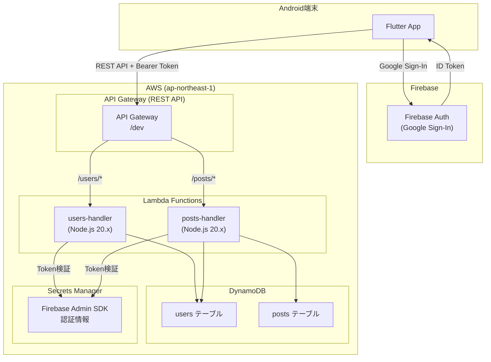
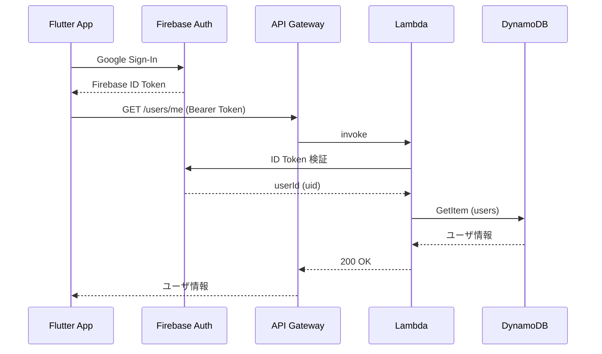

# アーキテクチャ設計

## 概要

Firebase Auth を使ったGoogle認証と、AWS Lambda + DynamoDB によるサーバレスバックエンドで構成します。

## システム構成図



## 認証フロー



## コンポーネント詳細

### フロントエンド（Flutter）

| コンポーネント | 役割 |
|--------------|------|
| LoginScreen | Googleログイン画面 |
| NicknameScreen | 初回ニックネーム設定 |
| HomeScreen | タブ付きメイン画面（全体フィード / 自分の投稿） |
| PostFormScreen | 言い間違い投稿フォーム |
| AuthService | Firebase Auth 管理 |
| ApiService | バックエンドAPI呼び出し |

### バックエンド（Lambda）

| Lambda関数 | ルート | 役割 |
|-----------|--------|------|
| kidsword-dev-users | /users/* | ユーザ管理 |
| kidsword-dev-posts | /posts/* | 投稿管理 |

両Lambda関数は共通の認証ミドルウェアでFirebase IDトークンを検証します。

### インフラ（Terraform）

- **API Gateway**: REST API、CORSはAndroidアプリからのみのためシンプル設定
- **Lambda**: Node.js 20.x、メモリ256MB、タイムアウト30秒
- **DynamoDB**: オンデマンド課金（PAY_PER_REQUEST）
- **Secrets Manager**: Firebase Admin SDK サービスアカウントキー保存

## セキュリティ設計

- すべてのAPIエンドポイントでFirebase ID Token検証必須
- Lambda関数はVPC外（パブリック）だがIAMロールで最小権限設定
- DynamoDBへのアクセスはLambda実行ロール経由のみ
- 機密情報（Firebase認証情報）はSecrets Managerで管理

## ディレクトリ構成

```
/
├── frontend/                    # Flutter アプリ
│   ├── android/
│   ├── lib/
│   │   ├── main.dart
│   │   ├── screens/
│   │   │   ├── login_screen.dart
│   │   │   ├── nickname_screen.dart
│   │   │   ├── home_screen.dart
│   │   │   └── post_form_screen.dart
│   │   ├── models/
│   │   │   ├── user.dart
│   │   │   └── post.dart
│   │   ├── services/
│   │   │   ├── auth_service.dart
│   │   │   └── api_service.dart
│   │   └── widgets/
│   │       └── post_card.dart
│   └── pubspec.yaml
│
├── backend/                     # Lambda バックエンド
│   ├── src/
│   │   ├── handlers/
│   │   │   ├── users.ts
│   │   │   └── posts.ts
│   │   ├── middleware/
│   │   │   └── auth.ts
│   │   ├── repositories/
│   │   │   ├── userRepository.ts
│   │   │   └── postRepository.ts
│   │   └── utils/
│   │       └── response.ts
│   ├── package.json
│   └── tsconfig.json
│
├── infrastructure/              # Terraform
│   ├── environments/
│   │   └── dev/
│   └── modules/
│       ├── api_gateway/
│       ├── lambda/
│       └── dynamodb/
│
└── docs/
    └── design/
```
