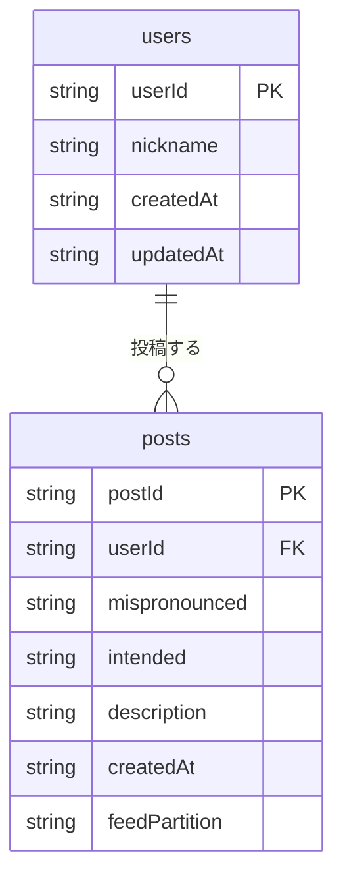

# DB設計

## テーブル一覧

### users テーブル

| 属性名 | 型 | キー | 説明 |
|--------|-----|------|------|
| userId | String | PK | Firebase UID |
| nickname | String | - | ニックネーム（必須） |
| createdAt | String | - | 作成日時（ISO 8601） |
| updatedAt | String | - | 更新日時（ISO 8601） |

### posts テーブル

| 属性名 | 型 | キー | 説明 |
|--------|-----|------|------|
| postId | String | PK | UUID v4 |
| userId | String | GSI1 PK | 投稿者のFirebase UID |
| mispronounced | String | - | 言い間違った言葉 |
| intended | String | - | 伝えたかった言葉 |
| description | String | - | 説明（任意） |
| createdAt | String | GSI1 SK / GSI2 SK | 投稿日時（ISO 8601） |
| feedPartition | String | GSI2 PK | 固定値 "ALL"（全体フィード用） |

## GSI（グローバルセカンダリインデックス）

### posts テーブル

| インデックス名 | PK | SK | 用途 |
|---------------|-----|-----|------|
| GSI1-userId-createdAt | userId | createdAt | 自分の投稿一覧（新着順） |
| GSI2-feedPartition-createdAt | feedPartition | createdAt | 全体フィード（新着順） |

## ER図

## アクセスパターン

| パターン | テーブル/インデックス | 操作 |
|---------|---------------------|------|
| ユーザ取得 | users（PK） | GetItem |
| ユーザ作成・更新 | users | PutItem |
| 投稿作成 | posts | PutItem |
| 自分の投稿一覧（新着順） | posts / GSI1 | Query（ScanIndexForward=false） |
| 全体フィード（新着順） | posts / GSI2 | Query（ScanIndexForward=false） |
